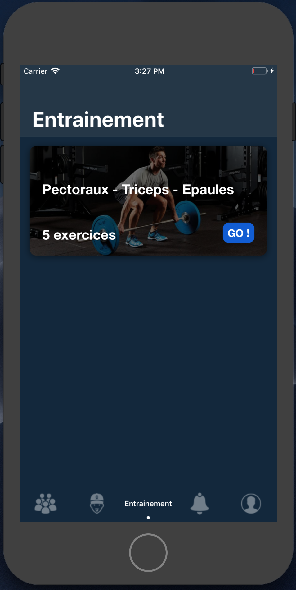
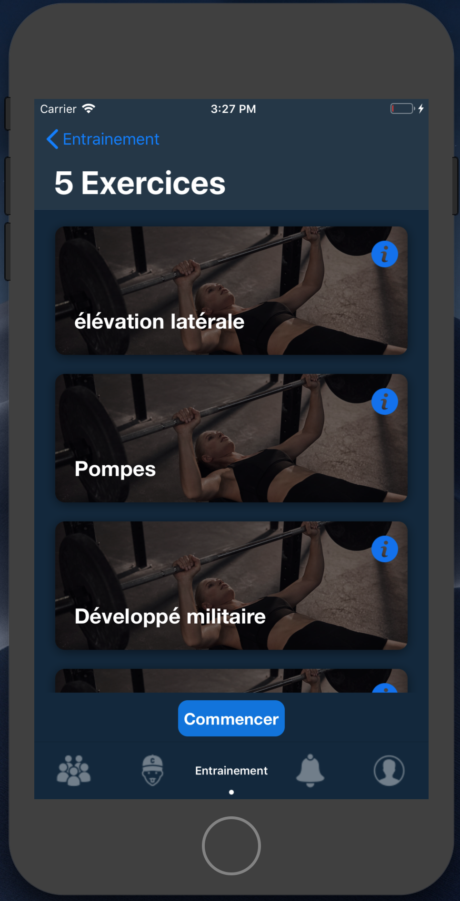
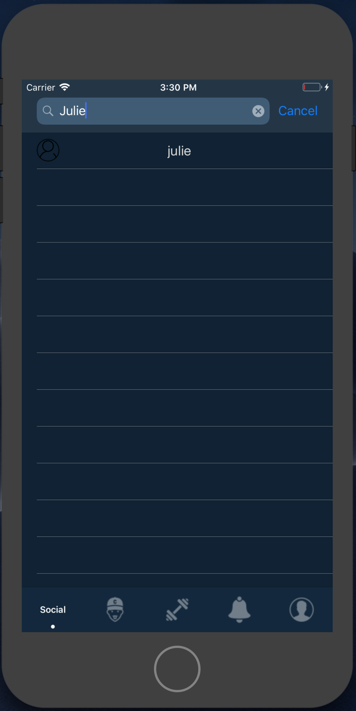
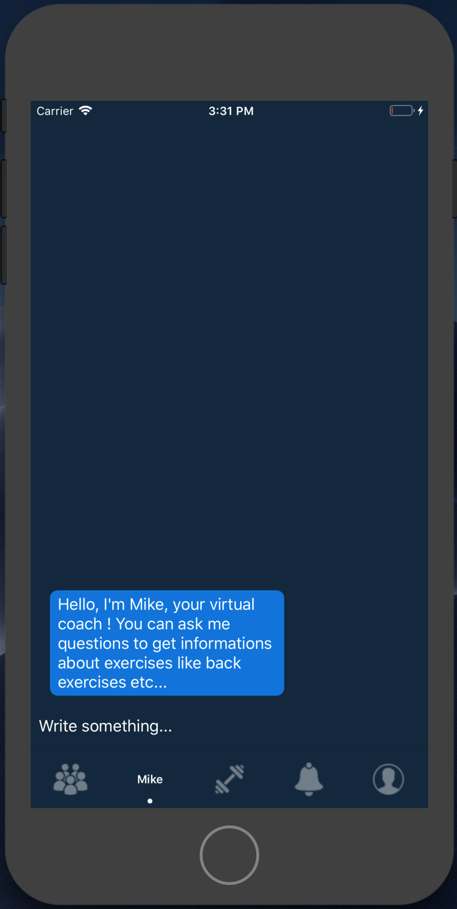
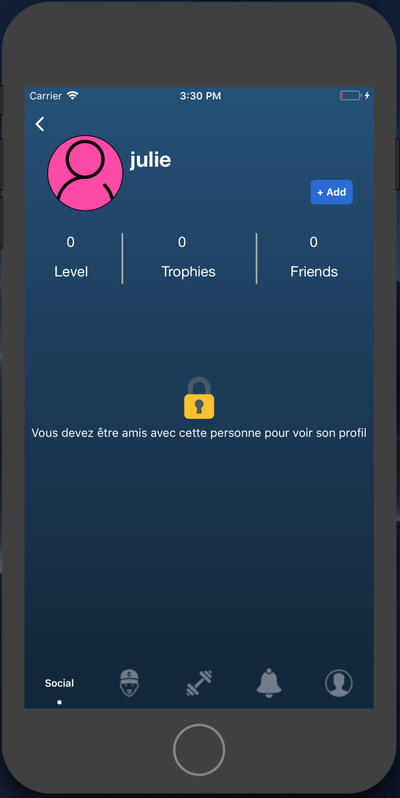
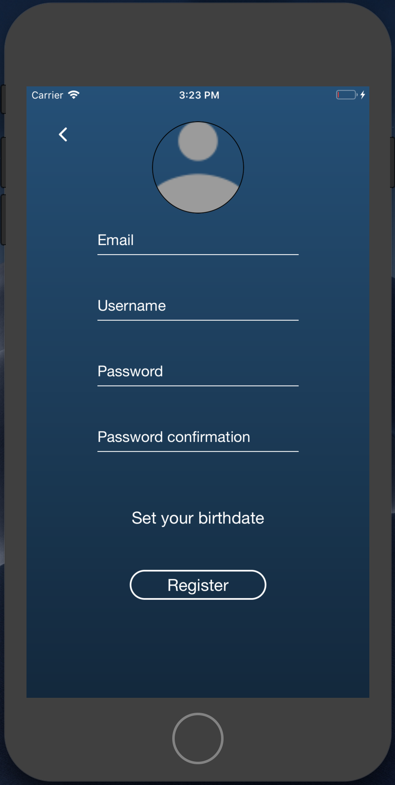
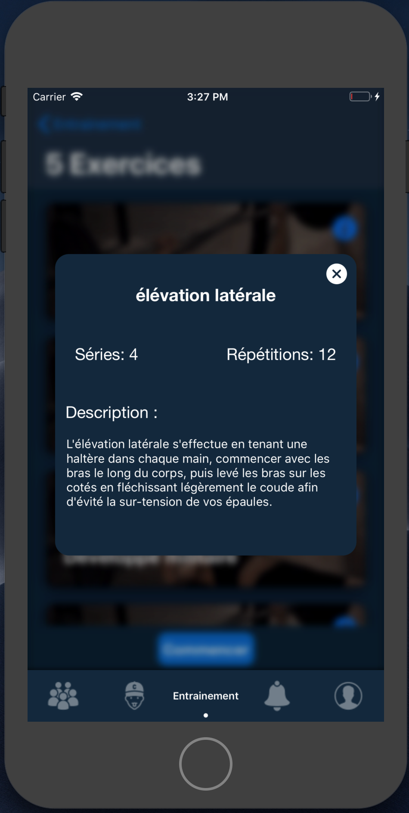

# MIKE
Year-end project (WIP)

Brief description of the project

Our goal is to design an intelligent sports coach for beginners and discouraged athletes using Machine Learning technology. This technology will allow us, thanks to the user's data, to have a follow-up that can be dynamically adapted to the user. In this way, the user will be able to benefit from a truly personalized and customizable coaching.

What issues does this project address?

This project responds to the problem of coaching by application or web services where all sports programs are already pre-designed. Indeed, following our research of information in this field, through sports magazines, technological journals and others, we have noticed that currently, this kind of service is totally impersonal and nothing adapts totally and dynamically to the user.

Customers will interact with the project through an application on Smartphone (iOs and Android). They will also be able to connect a bracelet or watch to this application in order to get a more effective feedback on their movements and activities.

